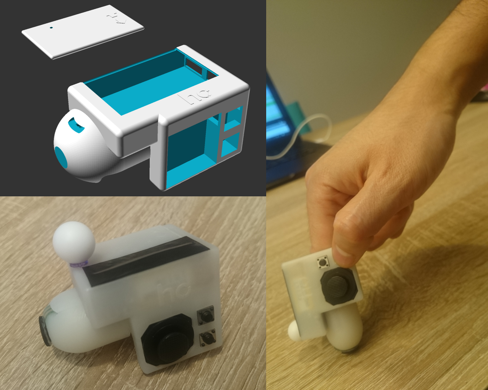
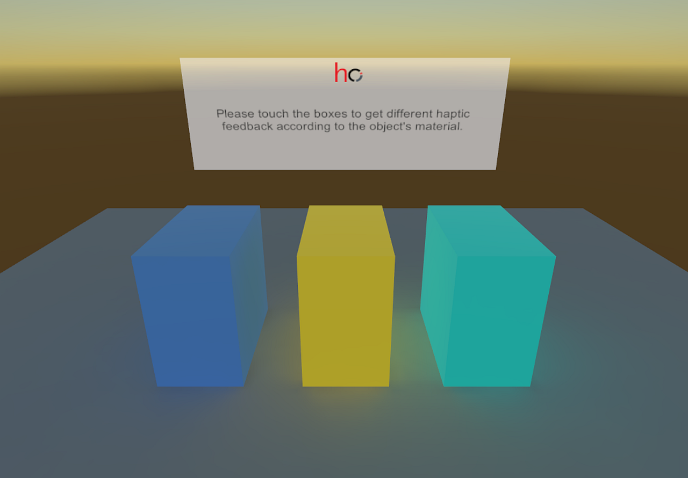

# HapFinger
<b>Vibrotactile Fingercap for Wireless Tabletop/3D Interaction</b>

This haptic device provides feedback with an LRA motor spinning at a resonant frequency of  200Hz  while  variating  the  intensity  from  level  0  to  128, and controlled by a dedicated haptic driver supporting overdriving and active braking. The device can also be configured to provide different vibrotactile patterns according to the task in execution. It is also possible to attach an IR marker and enable position tracking with external cameras.

This repository contains all the necessary files to build a new device. model files for 3D printing, schematics for electronics, embedded software binaries (the source will be released soon), source code of a BLE server to stablish a wireless device connection from a computer and the source code of an Unity demo application featuring vibrotactile feedback in a 3D environment.

The demo application requires a LeapMotion device to track the position of the hand and provide vibrotactile feedback whenever the index fingertip touches the objects in the 3D scene; the intensity of the feedback depends on the material properties.
